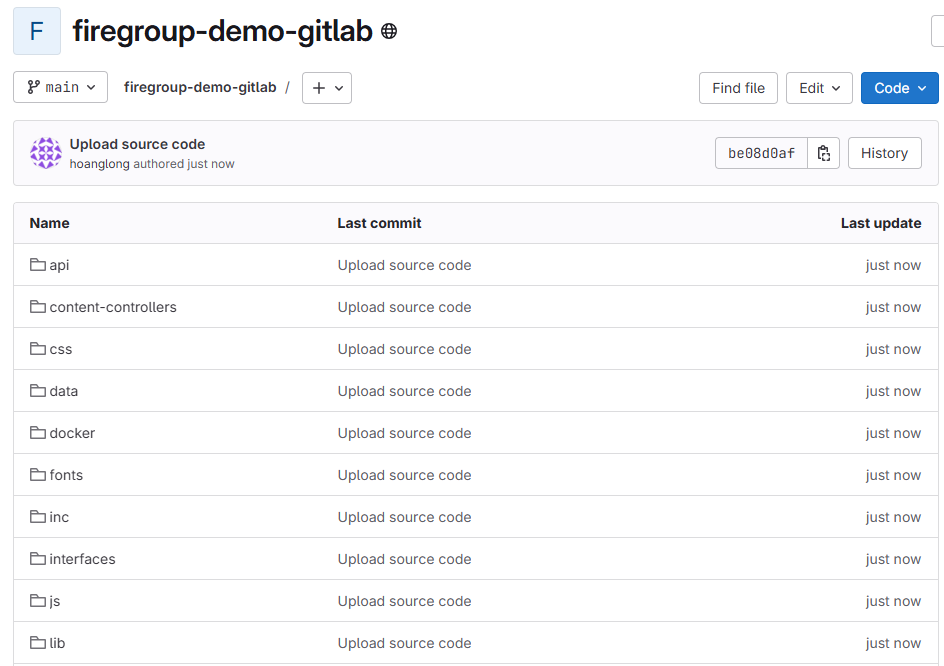
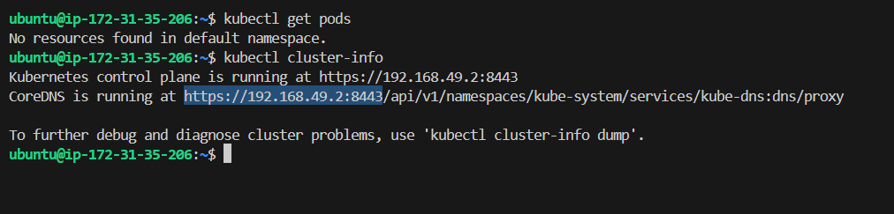
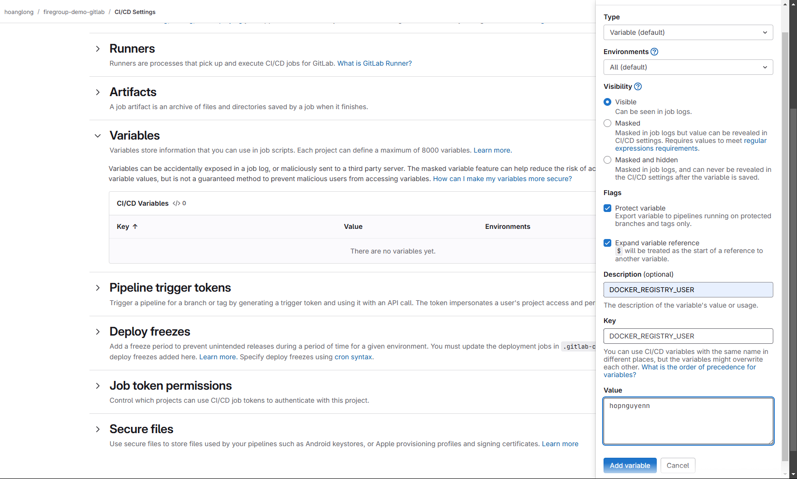

# 0. Sơ đồ triển khai dự án
- 
- Chúng ta sẽ triển khai các bước bao gồm
    + Tạo Gitlab runner
        - `docker-runner`
        - `shell-runner`
    + Tạo K8S cluster (minikube)
    + Tạo `.gitlab-ci.yaml` để chạy pipeline
        - `build and push`: build và push image lên dockerhub
        - `deploy`: deploy 3 pod trên K8S cluster

# 1. Tạo Gitlab repo
- 
    + Ta tạo gitlab repo có tên là `firegroup-demo-gitlab` chứa toàn bộ soure code

# 2. Tạo Gitlab runner trên EC2 (Executer docker)
## 2.1 Tạo EC2 instance
- Tiến hành tạo EC2 instance với các thông số:
    + Name: `docker-runner`
    + OS: `Ubuntu 20.04`
    + Instance type: `t3.medium`
    + Storage: `30GiB gp3`
    + Key pair: `jenkins-k8s-key`
    + 
    + 
    + 
- Kiểm tra sau khi EC2 chạy thành công
    + 
    + 

## 2.2 Cài đặt docker engine
- Ta sẽ cài đặt theo hướng dẫn này install docker
    + `sudo apt-get update`
    + `sudo apt-get install ca-certificates curl`
    + `sudo install -m 0755 -d /etc/apt/keyrings`
    + `sudo curl -fsSL https://download.docker.com/linux/ubuntu/gpg -o /etc/apt/keyrings/docker.asc`
    + `sudo chmod a+r /etc/apt/keyrings/docker.asc`
    + ``` 
        echo \
        "deb [arch=$(dpkg --print-architecture) signed-by=/etc/apt/keyrings/docker.asc] https://download.docker.com/linux/ubuntu \
        $(. /etc/os-release && echo "${UBUNTU_CODENAME:-$VERSION_CODENAME}") stable" | \
        sudo tee /etc/apt/sources.list.d/docker.list > /dev/null
      ``` 
    + `sudo apt-get update`
    + `sudo apt-get install docker-ce docker-ce-cli containerd.io docker-buildx-plugin docker-compose-plugin`
    + `sudo docker run hello-world`
    + `sudo groupadd docker`
    + `sudo usermod -aG docker $USER`
    + `newgrp docker`
    + `sudo systemctl enable docker.service`
    + `docker run hello-world`
- Kiểm tra sau khi cài xong
    + 

## 2.3 Tạo runner trên Gitlab UI
- Ta tiến hành tạo runner cho repo `firegroup-demo-gitlab`
    + 
    + 

## 2.4 Cài đặt gitlab-runner trên EC2 instance
- Ta dùng các lệnh sau để cài
    - `sudo curl -L --output /usr/local/bin/gitlab-runner "https://gitlab-runner-downloads.s3.amazonaws.com/latest/binaries/gitlab-runner-linux-amd64"`
    - `sudo chmod +x /usr/local/bin/gitlab-runner`
    - `sudo useradd --comment 'GitLab Runner' --create-home gitlab-runner --shell /bin/bash`
    - `sudo gitlab-runner install --user=gitlab-runner --working-directory=/home/gitlab-runner`
    - `sudo gitlab-runner start`
- Kiểm tra sau khi cài xong
    + 
## 2.5 Register runner trên Gitlab UI
- Ta đăng kí runner với các thông tin gồm:
    + Gitlab server: `https://gitlab.com`
    + Executor: `docker`
    + Name runner: `docker-runner`
    + 
- Kiểm tra trên Gitlab UI
    + 

# 3. Tạo Gitlab runner trên EC2 (Executer shell)
## 3.1 Tạo EC2 instance
- Tiến hành tạo EC2 instance với các thông số:
    + Name: `shell-runner`
    + OS: `Ubuntu 20.04`
    + Instance type: `t3.medium`
    + Storage: `30GiB gp3`
    + Key pair: `jenkins-k8s-key`
    + 
    + 
    + 
- Kiểm tra sau khi cài xong
    + 
    +    

## 3.2 Cài đặt docker engine
- Ta sẽ cài đặt theo hướng dẫn này install docker
    + `sudo apt-get update`
    + `sudo apt-get install ca-certificates curl`
    + `sudo install -m 0755 -d /etc/apt/keyrings`
    + `sudo curl -fsSL https://download.docker.com/linux/ubuntu/gpg -o /etc/apt/keyrings/docker.asc`
    + `sudo chmod a+r /etc/apt/keyrings/docker.asc`
    + ``` 
        echo \
        "deb [arch=$(dpkg --print-architecture) signed-by=/etc/apt/keyrings/docker.asc] https://download.docker.com/linux/ubuntu \
        $(. /etc/os-release && echo "${UBUNTU_CODENAME:-$VERSION_CODENAME}") stable" | \
        sudo tee /etc/apt/sources.list.d/docker.list > /dev/null
      ``` 
    + `sudo apt-get update`
    + `sudo apt-get install docker-ce docker-ce-cli containerd.io docker-buildx-plugin docker-compose-plugin`
    + `sudo docker run hello-world`
    + `sudo groupadd docker`
    + `sudo usermod -aG docker $USER`
    + `newgrp docker`
    + `sudo systemctl enable docker.service`
    + `docker run hello-world`
- Kiểm tra sau khi cài xong
    + 

## 3.3 Tạo runner trên Gitlab UI
- Ta tiến hành tạo runner cho repo `firegroup-demo-gitlab`
- 

## 3.4 Cài đặt gitlab-runner trên EC2 instance
- Ta dùng các lệnh sau để cài
    + `sudo curl -L --output /usr/local/bin/gitlab-runner "https://gitlab-runner-downloads.s3.amazonaws.com/latest/binaries/gitlab-runner-linux-amd64"`
    + `sudo chmod +x /usr/local/bin/gitlab-runner`
    + `sudo useradd --comment 'GitLab Runner' --create-home gitlab-runner --shell /bin/bash`
    + `sudo gitlab-runner install --user=gitlab-runner --working-directory=/home/gitlab-runner`
    + `sudo gitlab-runner start`
- Kiểm tra sau khi cài xong
    + 

## 3.5 Register runner trên Gitlab UI
- Ta đăng kí runner với các thông tin gồm:
    + Gitlab server: `https://gitlab.com`
    + Executor: `shell`
    + Name runner: `shell-runner`
    + 

## 3.6. Cài đặt k8s cluster trên ec2 (minikube)
## 3.6.1 Cài đặt minikube
- Ta sẽ cài đặt theo hướng dẫn này install minikube
- Ta gõ các lệnh để cài
    + `curl -LO https://github.com/kubernetes/minikube/releases/latest/download/minikube-linux-amd64`
    + `sudo install minikube-linux-amd64 /usr/local/bin/minikube && rm minikube-linux-amd64`
    + `minikube start`
    + `minikube status`
- Kiểm tra lại sau khi cài xong minikube
    + 
    + 

### 3.6.2 Cài đặt kubectl
- Ta dùng các lệnh này để cài `kubectl` để có thể giao tiếp với `K8S cluster
    + `sudo apt-get update`
    + `sudo apt-get install -y apt-transport-https ca-certificates curl gnupg`
    + `curl -fsSL https://pkgs.k8s.io/core:/stable:/v1.32/deb/Release.key | sudo gpg --dearmor -o /etc/apt/keyrings/kubernetes-apt-keyring.gpg`
    + `sudo chmod 644 /etc/apt/keyrings/kubernetes-apt-keyring.gpg`
    + `echo 'deb [signed-by=/etc/apt/keyrings/kubernetes-apt-keyring.gpg] https://pkgs.k8s.io/core:/stable:/v1.32/deb/ /' | sudo tee /etc/apt/sources.list.d/kubernetes.list`
    + `sudo chmod 644 /etc/apt/sources.list.d/kubernetes.list`
    + `sudo apt-get update`
    + `sudo apt-get install -y kubectl`

- Kiểm tra sau khi cài xong:
    + `kubectl get pods`
    + `kubectl cluster-info`
    + 

# 4. Pipeline
## 4.1 variables
- Thêm variables cho repo
    - `DOCKER_REGISTRY_USER`: `hopnguyenn`
    - `DOCKER_REGISTRY_PASSWORD`: `Docker123@`
        + Giá trị này ta sẽ chọn ẩn đi để không bị lộ thông tin trên Gitlab UI
    - 
    - 

## 4.2 Pipeline
### 4.2.1 Viết .gitlab-ci.yml file
- Pipeline sẽ gồm 2 stage là `build and push` và `deploy`, mỗi stage sẽ có 1 job tương ứng
    + `build and push`
        - runner: `docker-runner`
        - image: `kaniko` (cách này dùng để build và push image lên dockerhub mà không cần dùng docker-in-docker)
    + `deploy`
        - runner: `shell-runner`
- `.gitlab-ci.yml` file
    + ``` yaml
        stages:
            - build and push
            - deploy

        variables:
        DOCKER_HUB_REPO: "hopnguyenn/firegroup-demo"
        DOCKER_REGISTRY_HOST: "https://index.docker.io/v1/"
        DOCKERFILE_PATH: "$CI_PROJECT_DIR/docker/Dockerfile"

        build and push:
            stage: build and push
            tags:
                - docker-runner
            image:
                name: gcr.io/kaniko-project/executor:debug
                entrypoint: [""]
            before_script:
                - echo "{\"auths\":{\"${DOCKER_REGISTRY_HOST}\":{\"auth\":\"$(printf "%s:%s" "${DOCKER_REGISTRY_USER}" "${DOCKER_REGISTRY_PASSWORD}" | base64 | tr -d '\n')\"}}}" > /kaniko/.docker/config.json
            script:
                - |
                /kaniko/executor \
                    --context $CI_PROJECT_DIR \
                    --dockerfile $DOCKERFILE_PATH \
                    --destination $DOCKER_HUB_REPO:latest \
                    --skip-tls-verify

        deploy:
            stage: deploy
            tags:
                - shell-runner
            script:
                - echo "Deploying to Minikube..."
                - kubectl get pods
                - kubectl apply -f k8s-deployment.yaml
                - kubectl get pods
      ```
    + `variables`: định nghĩa các variable cần thiết cho pipeline
    + `build and push`:
        - `before_script`: thiết lập authen với dockerhub để push image
        - `script`: build và push image lên repo tương ứng
    + `deploy`: deploy image lên `k8s cluster`
### 4.2.2 Viết k8s-deployment.yaml file
- k8s-deployment.yaml
    + ``` yaml
        apiVersion: apps/v1
        kind: Deployment
        metadata:
          name: firegroup-demo
        spec:
          replicas: 3
          selector:
            matchLabels:
              app: firegroup-demo
          template:
            metadata:
              labels:
                app: firegroup-demo
            spec:
              containers:
              - name: firegroup-demo
                image: hopnguyenn/firegroup-demo:latest
                ports:
                - containerPort: 8080
      ```
- Ta dùng file này để tạo deployment có 3 pods với image được lấy từ `dockerhub`
### 4.2.3  Tiến hành tạo push event
- Chỉnh sửa các file cần thiết và push lên gitlab repo, pipeline trong `.gitlab-ci.yml` sẽ tự động được trigger
    + 
    + 

## 4.3 Kiểm tra sau khi pipeline chạy
- Kiểm tra image trên `dockerhub`
    + 
    + Ta thấy đã push image lên thành công
- Kiểm tra pipeline
    + 
    + 
    + 
    + 
    + Ta thấy đã dùng `kaniko` để build và push image lên `dockerhub` và deploy 3 pods lên `K8S cluster` thành công
- Kiểm tra tại `K8S cluster`
    + 
    + 
        - kubectl describe pod firegroup-demo-75cccd7f88-9wplz
    + 
        - kubectl logs firegroup-demo-75cccd7f88-9wplz
# 5. Kết luận
- Như vậy ta đã tạo thành công pipeline tự động trigger khi có push event
- Thiết lập runner cho Gitlab
- Build và push image lên dockerhub thông qua sử dụng `kaniko` thay vì `docker-in-docker`
- Deploy image lên 3 pods của `K8S cluster`